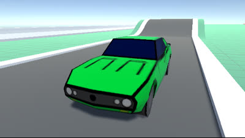

# Death Race 3030 / Car War 3030

Death Race 3030 ou Car War 3030 foi um jogo feito para a [Game Jaaj 2](http://jams.gamejolt.io/gamejaaj2). Ele não ficou muito jogável, mas foi o que deu pra fazer. Basicamente, você controla um carro que tem que ir pegando colecionáveis e fugir da polícia. Você pode tentar combater a polícia ao colidir nos seus veículos, porém você também leva dano.

Apesar de não ter ficado lá essas coisas, foi bem divertido trabalhar nesse projeto. Uma feature que eu me recordo bem era a maneira de mostrar a vida da polícia - um cubo fica em cima de cada um dos carros da polícia, e quanto mais dano esses carros levam, mais escuro os cubos ficam. Eu me inspirei em Brawlhalla, um jogo de luta em que a barra de vida também tem esse efeito.
